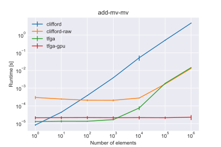
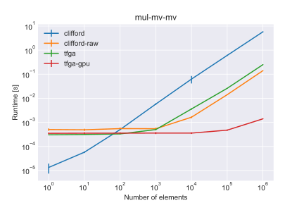

# Benchmarks
Here we compare the performance of TFGA (both CPU and GPU) against other libraries. The benchmark can be run using [generate.py](generate.py) and the plots created using [graph.py](graph.py).

The following libraries were compared with:
- [clifford](https://github.com/pygae/clifford)

The benchmarks below were created with the following specs:
- CPU: AMD Ryzen 7 2700X
- GPU: Nvidia GTX 1070
- RAM: 2x16GB (2800MHZ)
- OS: Windows 10 Pro 1903

And relevant libraries:
- tfga: 0.1.10
- tf-gpu-nightly: 2.3.0-dev20200515
- clifford: 1.3.0
- numpy (mkl): 1.18.1
- numba: 0.49.1

Also the environment variable `MKL_DEBUG_CPU_TYPE` was set to `5` in order to disable [crippling of AMD CPUs by MKL](https://www.reddit.com/r/MachineLearning/comments/f2pbvz/discussion_workaround_for_mkl_on_amd/).

### Addition A + B, Algebra=STA, A=Full Multivector, B=Full Multivector

### Geometric Product A * B, Algebra=STA, A=Full Multivector, B=Full Multivector
